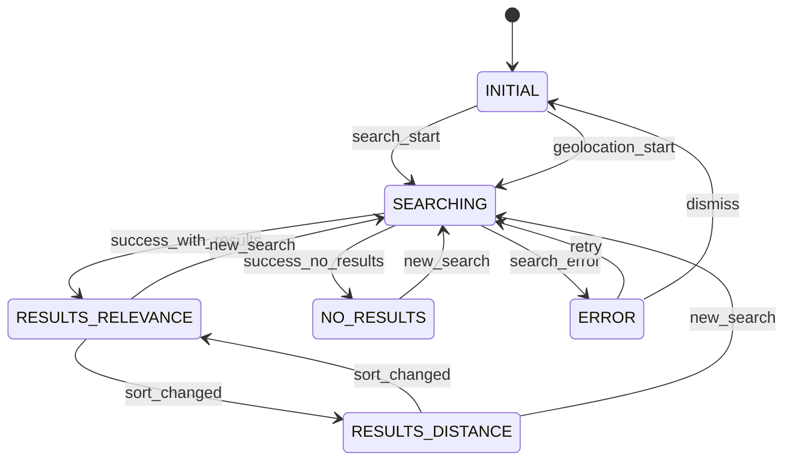
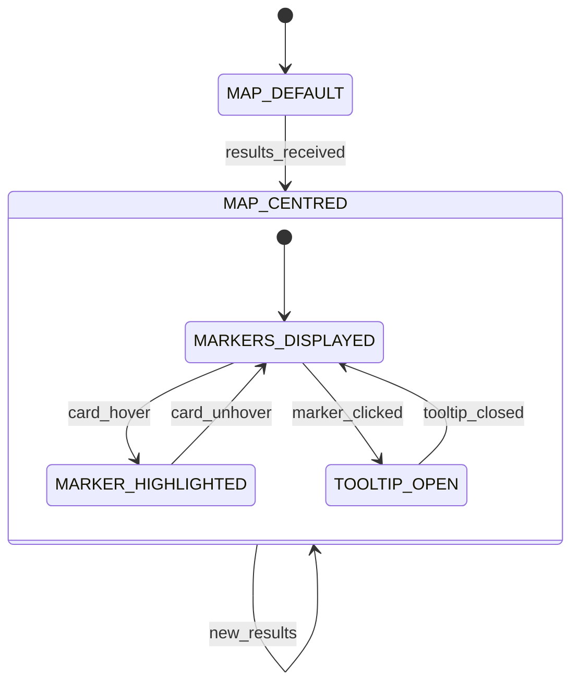
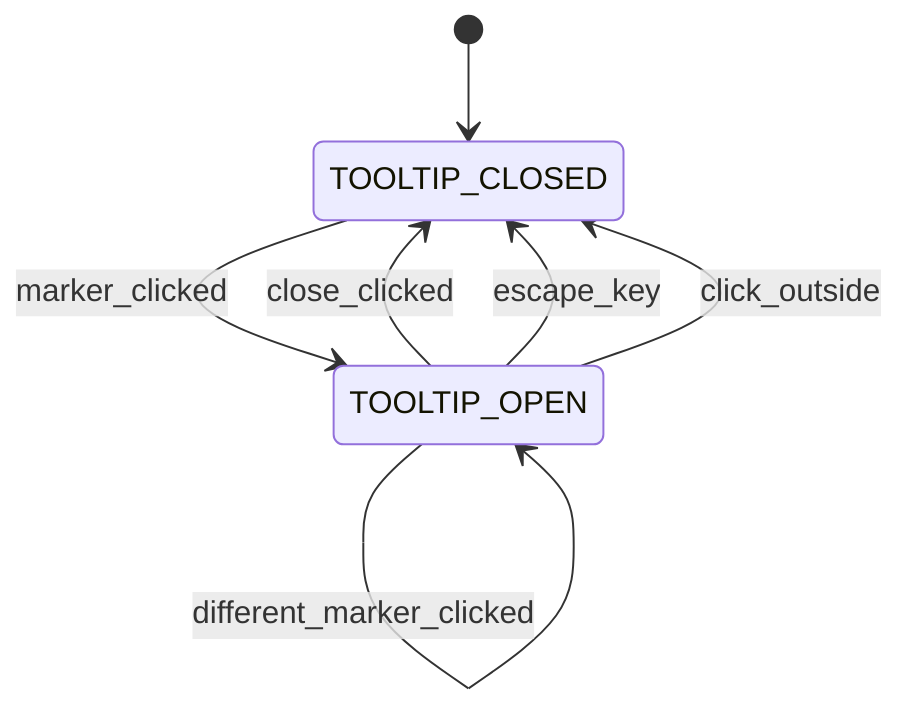
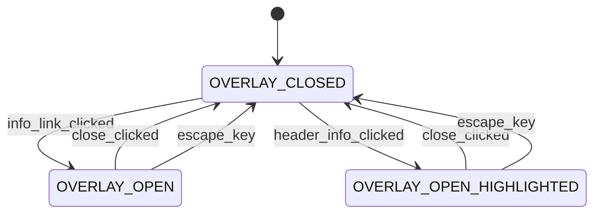
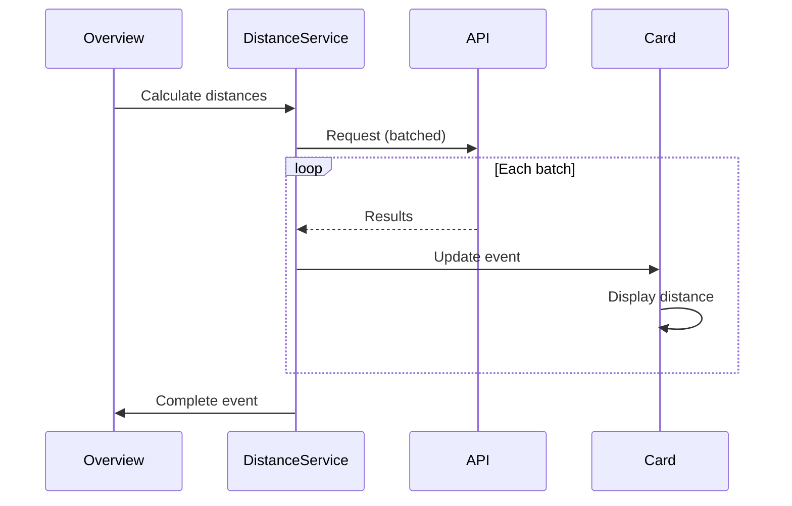
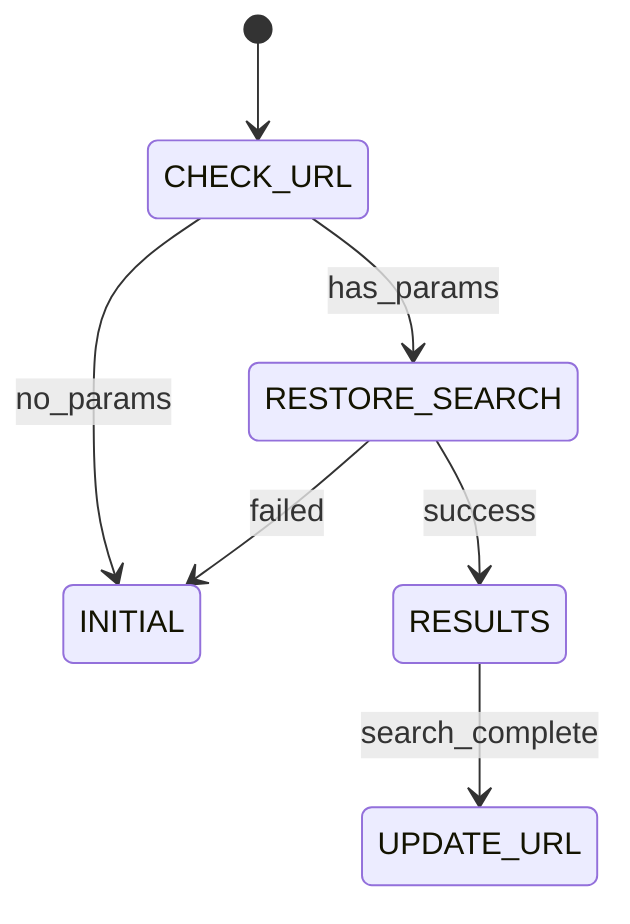

# Store Locator Overview - State Machine Diagrams

> **Note**: This document reflects the actual implementation, which uses a simplified architecture compared to the original specification.

**Last Updated**: January 2026  
**Status**: ✅ Synchronised with implementation

---

## What Changed from Original Design

The implementation uses a **simplified state machine** compared to the original specification:

| Aspect | Original Design | Actual Implementation |
|--------|-----------------|----------------------|
| UI States | 15 states (separate flows) | 6 states (unified flow) |
| Architecture | Explicit data fetching states | Event-driven via CustomEvents |
| Error States | Multiple error states | Single ERROR state |

### Benefits of Simplified Approach

1. **Easier to maintain** — Fewer states = less complexity
2. **More flexible** — Event system enables component decoupling
3. **Better performance** — Async updates do not block UI
4. **Graceful degradation** — Failures handled invisibly

---

## 1. UI State Machine

### State Descriptions

| State | Description | Visual Indicators |
|-------|-------------|-------------------|
| `INITIAL` | Page loaded, no search | Empty input, regional map view |
| `SEARCHING` | Search in progress | Loading indicator visible |
| `RESULTS_RELEVANCE` | Results grouped by type | Section headers, sorted by ranking |
| `RESULTS_DISTANCE` | Results sorted by distance | Flat list, closest first |
| `NO_RESULTS` | No results found | Empty state message |
| `ERROR` | Search failed | Error message with retry |

### Key Implementation Details

- **Unified search flow**: Text search and geolocation use the same states
- **Search mode tracked internally**: Flag distinguishes search types
- **Error consolidation**: All errors use single state with different messages
- **Async distance calculation**: Happens after state transition

---

## 2. Map State Machine

The map is **display-only** — it responds to search results but does NOT trigger searches.

**Key Principle**: Panning/zooming the map does NOT affect the results list.

---

## 3. Tooltip State Machine

### Accessibility

Implements APG Non-Modal Dialog Pattern:

- `role="dialog"` with `aria-labelledby`
- Focus moves to dialog on open
- Escape key closes
- Focus returns to trigger on close

---

## 4. Information Overlay State Machine

When opened from a results header, the corresponding section is highlighted.

---

## 5. Distance Calculation Flow

Distance calculation is handled asynchronously via events:

### Graceful Degradation

If distance calculation fails:

- Distance shows "—" instead of value
- No error shown to user
- Sorting falls back to straight-line distance

---

## 6. Sort Mode Behaviour

### Relevance Sort (Default)

1. Results rendered immediately, grouped by type
2. Distances calculated asynchronously
3. Cards update in-place as distances arrive

### Distance Sort

1. Loading state shown
2. All distances calculated
3. Results sorted and rendered
4. Falls back to straight-line if API fails

---

## 7. URL Synchronisation

### URL Parameters

| Parameter | Description |
|-----------|-------------|
| `q` | Search query |
| `lat` | Latitude (geolocation) |
| `lng` | Longitude (geolocation) |
| `sort` | Sort mode |

---

## Summary

### Implementation Status

| Feature | Status |
|---------|--------|
| Text Search | ✅ Complete |
| Geolocation Search | ✅ Complete |
| Map Display | ✅ Complete |
| Results Sorting | ✅ Complete |
| Distance Calculation | ✅ Complete |
| URL Persistence | ✅ Complete |
| Map Tooltip | ✅ Complete |
| Error Handling | ✅ Complete |

### Key Patterns

1. **Event-driven communication** between components
2. **Async distance updates** that do not block rendering
3. **Graceful degradation** for API failures
4. **Unified state machine** for both search modes

---

*Document updated: January 2026*
